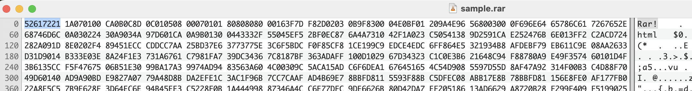

# Задание 1. Отчет

## 1. Сигнатуры форматов
| Формат | Сигнатура  | Источники |
|------------|------------|------------|
| RAR | 52 61 72 20 1A 07 01 00 | Из документации: https://www.rarlab.com/technote.htm#arcstruct  |
| ZIP  | 50 4B 03 04 |  |
| ZIP (пустой) | 50 4B 05 06 |  |
| ZIP (расширенный) | 50 4B 07 08 |  |
| JPEG  |  |  |
| MP3  | 49 44 33 | Из документации: https://id3.org/id3v2.4.0-structure  |

## 2. Запуск Yara
Правила для поиска форматов файлов лежат в файле **file_formats.yara**

### RAR
Для версии RAR3 (2000-2002), RAR4(2011-2013) сигнатура 52 61 72 21 1A 07 00
Для версии RAR5 (2013+) сигнатура 52 61 72 21 1A 07 01 00

ВСТАВИТЬ СКРИН С ДЕТЕКЦ ПРАВИЛА

### ZIP

### JPEG

### MP3
