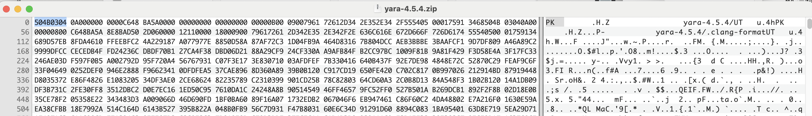
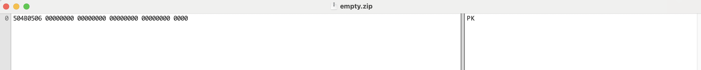
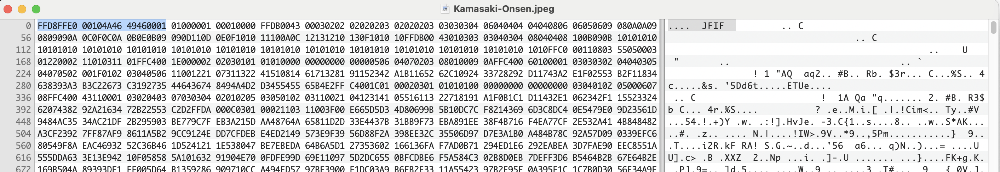
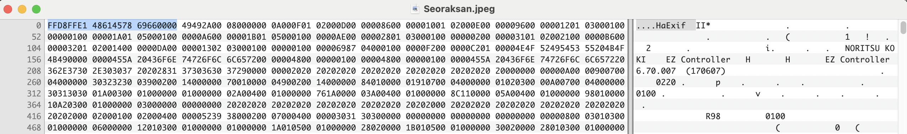
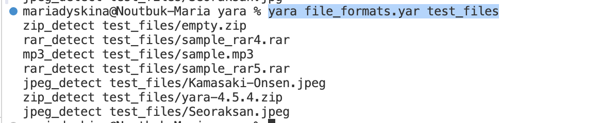

# Задание 1. Отчет

## 1. Сигнатуры форматов
| Формат | Сигнатура  | Источники | Форматы с такой же сигнатурой
|------------|------------|------------|------------|
| RAR(3,4) | 52 61 72 20 1A 07 00 | Из документации: https://www.rarlab.com/technote.htm#arcstruct  | |
| RAR5 | 52 61 72 20 1A 07 01 00 | Из документации: https://www.rarlab.com/technote.htm#arcstruct  | |
| ZIP  | 50 4B 03 04 | https://ru.wikipedia.org/wiki/Список_сигнатур_файлов |formats based on zip: JAR, ODF, OOXML (jar, odt, ods, odp, docx, xlsx, pptx, vsdx, apk, aar) |
| ZIP (пустой) | 50 4B 05 06 | https://ru.wikipedia.org/wiki/Список_сигнатур_файлов | |
| JPEG  | FF D8 FF DB | https://ru.wikipedia.org/wiki/Список_сигнатур_файлов | |
| JPEG/JFIF  |FF D8 FF E0 ?? ?? 4A 46 49 46 00 01| https://ru.wikipedia.org/wiki/Список_сигнатур_файлов | |
| JPEG/EXIF  |FF D8 FF E1 ?? ?? 45 78 69 66 00 00| https://ru.wikipedia.org/wiki/Список_сигнатур_файлов | |
| MP3  | 49 44 33 | Из документации: https://id3.org/id3v2.4.0-structure  | |

## 2. Запуск Yara
Правила для поиска форматов файлов лежат в файле **file_formats.yara**
  
Примеры файлов с необходимыми расширениями лежат в папке **test_files**.

### RAR
sample_rar4.rar в формате RAR4:

sample_rar5.rar в формате RAR5:

### ZIP
Архив yara-4.5.4.zip:

Пустой архив empty.zip:

### JPEG
JPEG/JFIF (с метаданными для совместимости между различными устройствами)

JPEG/EXIF (с метаданными камеры)

### MP3

### Вывод после команды yara file_formats.yar test_files:

